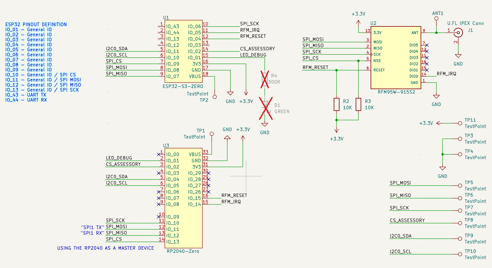

The Nibble is a mini Meshtastic node created for 38c3 for my talk: "[**Hacker's Guide to Meshtastic: Off-Grid, Encrypted LoRa Meshnets for Cheap!**](https://media.ccc.de/v/38c3-hacker-s-guide-to-meshtastic-off-grid-encrypted-lora-meshnets-for-cheap "Hacker's Guide to Meshtastic: Off-Grid, Encrypted LoRa Meshnets for Cheap!")"

The design was prototyped by Kody Kinzie, art was created by Felix Orozco, and PCB and schematics were created by Zac Beran. Software was created by (discord handles): Jonathan Bennett, GinNTonic, Ennui, thebentern, MC Hamster

# Nibble Design:

The Nibble is designed to act as your first Meshtastic node, with room for upgrades in antennas and sensors. It can be placed in an elevated area within a sealed 1 inch (25mm) PVC pipe to act as a router, weather station, or fixed client and accessed over Wi-Fi, Bluetooth or serial.

# Schematics:

RP2040 version:
The Nibble can be assembled from an RP2040 Zero instead of an ESP32s3 Zero. While this prevents a Wi-Fi or Bluetooth connection, these nodes make good low-cost router nodes.

# Hardware Assembly:

**Parts:**

**1) 1x Nibble PCB**

**2) LoRa Radio (rfm95)**

**3) 1x Host Micro controller - (esp32s3 or rp2040)**

**4) 1x LED**

**5) 2x 10k 1206 resistors**

**6) 1x 330 ohm resistor**

**7) 1x 868 mhz antenna**

**8) (optional) 1x u.fl antenna connector**

# **#1 Resistors**

The first step is the most challenging, adding the resistors. These are the smallest parts, and will be the most difficult.

We recommend applying some solder to one pad, and using tweezers to place the resistors. Don't hesitate to ask for help if you are having a hard time with this step.

First, solder the two 10k ohm resistors. They are marked "1002" and go on the two right pads.

Next, solder on the 330 ohm resistor to the remaining pad. If you don't have one, you can bridge this this last pad for an extra-bright LED.

# **#2 Radio Module**

Next, place the RFM95 radio module. You'll see the outline of the parts to make sure it's oriented the correct direction.

# **#3 Host Microcontroller**

Next up, we'll solder on the host microcontroller. You can pick between the higher-end ESP32s3 with wi-fi and bluetooth, or the serial-only RP2040. **ONLY USE ONE!**

Look at the PCB to find the footprint with the correct label. The esp32s3 is soldered on to the back of the board, below the LoRa radio.

If you use the RP2040, you will solder it to the other side of the board.

# **#4 LED**

Next, solder the LED into the top of the left ear. Make sure to pay attention to the polarity! The square pin is the negative pin.

# **#5 Antenna**

Now, let's add an antenna to the ANT1 hole. This can be a wire or coil antenna soldered directly.

# **Optional: U.FL connector
**

Finally, if you would like to add a clip-on antenna, you can add a U.FL connector. Be careful! This is a small part that's easy to melt.

# Software:

To flash your Nibble, you can flash a compiled binary, or compile your own. It's much easier to flash compiled firmware than it is to compile on your own.

The instructions for flashing the ESP32s3 based Nibble are different than for the RP2040 version, so follow the correct one for your Nibble type below.

## RP2040 Nibble:

Hold down the BOOT button while plugging in your Nibble.

Once it shows up as a connected USB drive, Drag and drop the "firmware.uf2" file into the drive. The firmware will automatically install and reboot.

**ESP32s3 Nibble:**

Hold down the "B" button while plugging in your Nibble.

You can use a web browser or command line to install your firmware.

First, download the BIN file on the Github: [https://github.com/RetiaLLC/38c3-Meshtastic/blob/main/nibble\_flasher.zip](https://github.com/RetiaLLC/38c3-Meshtastic/blob/main/nibble_flasher.zip)

### Web Browser:

Unzip the folder and navigate to [Nugget.dev](https://nugget.dev "Nugget.dev") in a chrome browser.

Select "Connect your nugget"

Select your Nibble from the drop-down list of serial ports.

### 

Click "Upload custom binary" and select the "firmware-nibble-esp32s3-master.bin" file inside the folder you unzipped.

Click "Erase" and "Program" to flash your Nibble. When it's done, unplug it and plug it back in to run the new firmware.

### Command line:

You'll need [esptool](https://docs.espressif.com/projects/esptool/en/latest/esp32/ "esptool") installed to continue.

Unzip the folder and run the following command from within the unzipped folder:

**./device-install.sh -f firmware-nibble-esp32s3-master.bin**

Once finished, unplug your Nibble and plug it back in. The new firmware should run and the LED will light up!

# **Compile your own firmware**

Here is the repo for building your own firmware: [https://github.com/meshtastic/38c3](https://github.com/meshtastic/38c3 "https://github.com/meshtastic/38c3")

Follow the instructions here: [https://meshtastic.org/docs/development/firmware/build/](https://meshtastic.org/docs/development/firmware/build/ "https://meshtastic.org/docs/development/firmware/build/")
